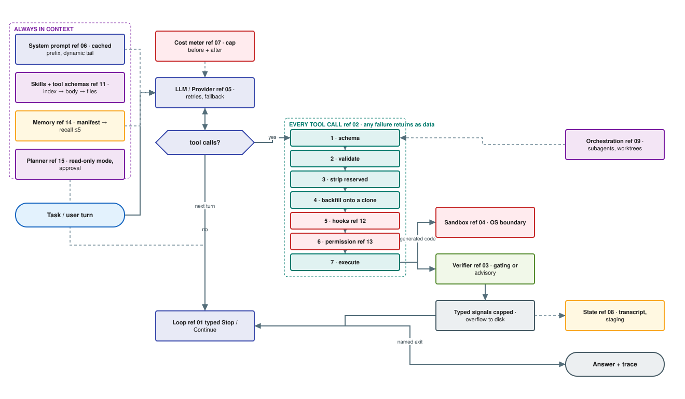
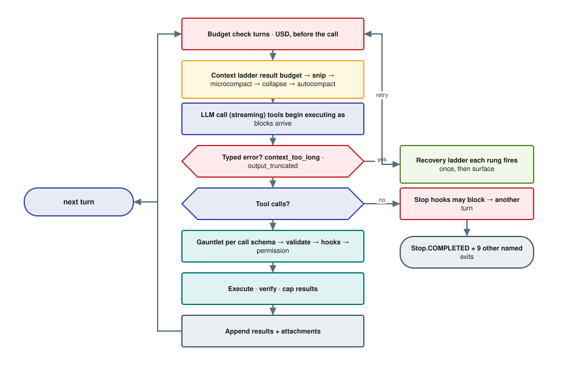
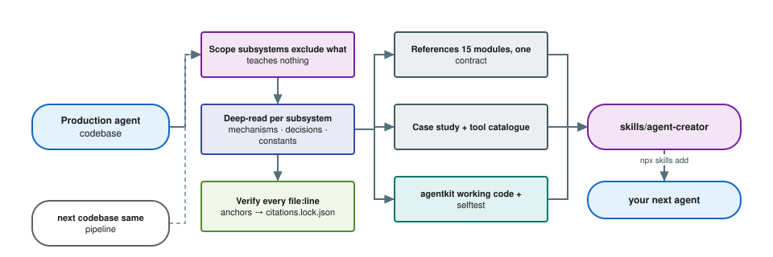

<div align="center">

# agent-creator-skill

**Turn production agent architecture into a reusable skill.**
15 module references with machine-verified provenance, plus a working
stdlib-only agent core you can lift.

<!-- tags -->
[](skills/agent-creator/SKILL.md)
[](plugin.json)
[](plugin.json)
[](LICENSE)
[](skills/agent-creator/templates/agentkit/)
[](skills/agent-creator/templates/agentkit/)
[](tools/verify_citations.py)
[](skills/agent-creator/templates/agentkit/tests.py)
[](docs/AUDIT.md)
[](skills/agent-creator/case-studies/)

`agent` · `llm-agent` · `agent-architecture` · `claude-code` · `agent-skill`
· `tool-use` · `reverse-engineering`

</div>

```bash
npx skills add alfredzhang98/agent-creator-skill --skill agent-creator
```

Then tell your coding agent (Claude Code, Codex, Cursor, …):
*"Using the agent-creator skill, build me an agent that does X."*

---

Most agent knowledge is trapped inside working codebases: the loop invariants,
the guardrail constants, the failure modes someone already paid to discover.
This repository extracts that knowledge from two production agents into an
installable **skill** — so your next agent is designed against patterns known
to survive production, instead of reinventing a fragile ReAct loop.

Not a prompt collection, and not a framework. A design reference with
verifiable sources, and a reference implementation that runs.

## What you get

Ask for an agent and you get all fifteen of these designed together, not a
loop with tools bolted on:

| # | Capability | What it actually does |
|---|---|---|
| 01 | **Turn loop** | A state machine with a closed set of named exits and named continuations, so "why did this stop?" is a value, not an investigation. Recovery ladders for context overflow, truncated output and model failover — each rung fires once, then surfaces. |
| 02 | **Tool layer** | A declarative tool contract whose safety predicates are functions *of the input*. Seven-stage dispatch gauntlet. Every failure returns as data the model can correct from — never an exception. Results cap per tool and per message, overflowing to disk instead of truncating. |
| 03 | **Verifier** | Gating (refuses the exit) or advisory (reports without blocking), chosen deliberately. The advisory tier is attribution-scoped and report-once, so the model is told what *its* edit broke rather than what the repository already had wrong. |
| 04 | **Sandbox** | An OS-level boundary contract for anything the model generates — filesystem allow/deny, network allowlists, process caps — with a fail-closed default. Isolation is what buys the agent autonomy. |
| 05 | **Provider layer** | One seam over N backends, plus the five-stage context ladder: per-message result budget → snip → microcompact → collapse → summarise, cheapest and most reversible first. |
| 06 | **Prompt assembly** | Prompt-as-code with memoised sections, an explicit cacheable/volatile boundary, and cache-breaking that must be justified at the call site. |
| 07 | **Cost control** | Hard USD cap checked before *and* after each call, per-model ledgers with cache tokens broken out, and unknown pricing that estimates-and-flags rather than silently disabling the cap. |
| 08 | **State** | Append-only transcript, atomically written metadata, staging-then-promote for artifacts, and tolerant readback that repairs orphaned tool calls on resume. |
| 09 | **Orchestration** | Declarative subagents with per-class capability restriction, worktree isolation, and allowlists that *replace* rather than extend so parent approvals cannot leak into a child. |
| 10 | **Action space** | The root decision: constrain what the model may produce, because everything downstream — validation, error messages, mechanical QC — is only possible if you did. |
| 11 | **Progressive disclosure** | Skills and tool schemas that cost one line each until invoked. Index → body → directory. Plus the rule that pays for itself: nothing volatile in a cached prefix. |
| 12 | **Hooks** | 17 lifecycle events, an exit-code *and* JSON reply protocol, most-restrictive-wins aggregation, and an unconditional trust gate. Other people extend your agent without forking it. |
| 13 | **Permissions** | A numbered consent ladder where some decisions are immune to "skip all prompts", and unknown always means ask. This is what says "no" when no compiler can. |
| 14 | **Memory** | Cross-session memory defined by non-derivability, recalled through a cheap-model pass over a manifest, with staleness carried alongside the content. |
| 15 | **Planning** | Plan mode as an enforced read-only *permission mode*, a plan written to disk before approval, and progress tracked with exactly one task in flight. |

### How they fit together



The load-bearing shape: **the model never reaches the world directly.** Every
tool call walks the same seven gates, and every failure inside them comes back
as data rather than an exception. The loop — not the model — owns the exit.

### One turn, end to end



> Diagrams are [draw.io](https://www.drawio.com/) files. The `.drawio.svg`
> renders here and re-opens for editing; the matching `.drawio` in
> [`docs/diagrams/`](docs/diagrams/) loads into draw.io, the VS Code extension,
> or [next-ai-draw-io](https://github.com/DayuanJiang/next-ai-draw-io) for
> AI-assisted editing. Both are generated from one spec by
> [`tools/make_diagrams.py`](tools/make_diagrams.py), so they cannot drift.

## The code

[`templates/agentkit/`](skills/agent-creator/templates/agentkit/) is a working
agent core, not pseudocode. Stdlib only, no dependencies:

```bash
python3 skills/agent-creator/templates/agentkit/selftest.py   # worked example
python3 skills/agent-creator/templates/agentkit/tests.py      # 120 assertions
```

> **Audited.** An independent multi-agent review ([docs/AUDIT.md](docs/AUDIT.md))
> reproduced 33 defects in an earlier version of this code — three security
> inversions, one flagship feature that could never work, and ten claims in the
> references that misread their own sources. All are fixed and covered by
> regression tests. The audit is published rather than quietly folded in,
> because the most useful finding was methodological: the original self-test
> passed 14/14 by asserting up to the point where each bug began.
>
> Still true: this code has never run against a live model.

| Module | What it gives you |
|---|---|
| `contract.py` · `registry.py` · `pipeline.py` | Tool contract with fail-closed defaults, cache-stable pool assembly, the seven-stage gauntlet |
| `permissions.py` · `hooks.py` | Consent ladder with bypass-immune classes; 17-event hook protocol |
| `loop.py` · `verifier.py` · `state.py` | Typed-transition loop, attribution-scoped verifier, transcript + staging + resume repair |
| `memory.py` · `planner.py` · `skills_loader.py` · `result_store.py` | Recall ladder, plan-mode phase machine, progressive disclosure, overflow-to-disk |
| `tools/` | Read · Write · Edit · Glob · Grep · TodoWrite · AskUserQuestion · Shell · ToolSearch · Skill |

Read [`selftest.py:build_agent`](skills/agent-creator/templates/agentkit/selftest.py)
first — it is the shortest honest example of wiring the pieces together.

## What's inside

```
skills/agent-creator/
├── SKILL.md                     # entry point: anatomy, build order, invariants
├── references/                  # one deep-dive per agent module
│   ├── 00-agent-anatomy.md      #   the module map & how modules interlock
│   ├── 01-agent-loop.md         #   turn lifecycle, typed exits, recovery ladders
│   ├── 02-tools.md              #   declarative tools, errors-as-data, result caps
│   ├── 03-evaluator-verifier.md #   gating vs advisory, typed signals
│   ├── 04-sandboxed-execution.md#   OS isolation vs process supervision
│   ├── 05-providers.md          #   multi-LLM seam, the five-stage context ladder
│   ├── 06-prompts.md            #   prompt-as-code, cache boundary, attachments
│   ├── 07-cost-guardrails.md    #   pricing tables, dual ledgers, hard caps
│   ├── 08-state-persistence.md  #   staging→promote, transcripts, tolerant resume
│   ├── 09-orchestration.md      #   entry points, subagents, fork/rerun
│   ├── 10-action-space-sdk.md   #   shaping what the model may produce
│   ├── 11-skills-…              #   progressive disclosure: skills, deferred tools
│   ├── 12-hooks-and-extension.md#   lifecycle events, blocking protocol, trust
│   ├── 13-permission-…          #   the consent ladder; what says "no"
│   ├── 14-memory.md             #   non-derivability, recall ladder, staleness
│   └── 15-planning.md           #   plan mode, approval gate, progress tracking
├── templates/
│   ├── agentkit/                # a WORKING agent core (stdlib only, runs)
│   └── *.py                     # per-pattern skeletons (verifier, cost, sandbox)
└── case-studies/
    ├── README.md                # how to distill the next agent
    ├── articraft.md             # case 01: agentic 3D-asset generator
    ├── claude-code.md           # case 02: general-purpose coding agent
    └── claude-code-tool-catalog.md  #   its 42 tools, annotated: steal these
```

Every module reference (01-15) follows one contract: **why the module exists →
how real agents implement it (with `file:line`) → design decisions with
tradeoffs → production constants with the reason for each number → a reusable
pattern → pitfalls → checklist.** Where the two agents disagree, a comparative
section says who does what, and why.

## Usage

- *"Using the agent-creator skill, design an agent that writes and verifies
  SQL migrations."*
- *"Add a hard cost cap to my agent — follow reference 07."*
- *"Review my agent loop against the pitfalls in references 01 and 03."*
- *"My agent keeps asking permission for everything. Fix it using reference 13."*

## The five invariants

Tagged by evidence strength, because it differs — *mechanical* follows from
the API or OS contract, *converged* means both distilled agents independently
arrived at it (strong, but n=2), and *single-source* means one agent does it
well and you should question it in your domain:

1. **Success is verified, never self-reported** *(converged)* — revision-gated
   fresh verify, or an advisory verifier plus a human. Never zero authorities.
2. **Tool errors are data, not exceptions** *(mechanical)* — a raised exception
   leaves a dangling `tool_use_id` and breaks the next call.
3. **One primary issue at a time** *(single-source: Articraft)* — a priority
   ladder over N failures. Claude Code reports all new findings instead and
   keeps the list short by attribution-scoping. Pick per domain.
4. **Budgets are enforced in the loop** *(mechanical)* — USD cap pre-call and
   post-usage.
5. **Never execute generated code without an isolated sandbox** *(mechanical:
   a security property)* — a child process is killable isolation, not a
   boundary.

And one corollary from the second case study: **anything volatile belongs in
the mutable tail, never in a cached prefix.** One interpolated list inside a
tool description cost a production fleet ~10.2% of its cache-creation tokens.

## Where the knowledge comes from



- **[Articraft](skills/agent-creator/case-studies/articraft.md)** — text →
  articulated 3D assets; ~20k lines read and verified. Contributes references
  00–10 and the compile-feedback verifier pattern.
- **[Claude Code](skills/agent-creator/case-studies/claude-code.md)** 2.1.88 —
  a general-purpose coding agent with a human in the loop; ~377k lines of
  non-UI source read and verified. Contributes references 11–15, the
  typed-transition loop, the five-stage context ladder, the whole of
  [`agentkit/`](skills/agent-creator/templates/agentkit/), and an
  [annotated catalogue of its 42 tools](skills/agent-creator/case-studies/claude-code-tool-catalog.md).

The two were chosen to disagree. Articraft's success is decided by a compiler;
Claude Code's by a person. That single difference explains why one invests in a
verifier and the other in a permission system — and the comparative sections it
produces are the most useful pages in the library.

**Known limits, stated plainly:** n=2, both from one ecosystem, both producing
artifacts. The constants come from one pinned version. The agentkit passes its
own tests but has not been run against a live model. Treat the patterns as very
good defaults, not laws.

## Provenance, and how far it is checked

Every `file:line` points at a pinned source tree (`claude-code-2.1.88`).
[`tools/verify_citations.py`](tools/verify_citations.py) checks them and records
a **content anchor** — a fingerprint of the lines actually cited — in
`tools/citations.lock.json`:

```bash
python3 tools/verify_citations.py            # check against the lockfile
python3 tools/verify_citations.py --update   # re-anchor after editing docs
python3 tools/verify_citations.py --source <newer-tree> --version 2.2.0
```

The anchors are the point. A checker that only confirms "this file has enough
lines" passes happily on a citation whose target has been refactored away; this
one reports `DRIFTED` and shows the divergence. The lockfile is committed and
the source tree is not, so the library can be re-checked against a version it
was never written against.

What this does **not** prove: that the claim built on a citation was a correct
reading in the first place. Anchors catch drift and typos, not
misinterpretation.

## Security posture

This repository is **documentation plus a working agent harness**. The harness
ships no execution engine: there is no `exec`, `eval`, `compile`, `subprocess`,
or process spawn in any module an agent would import. The one exception is
`agentkit/tests.py`, which re-runs one function in a fresh interpreter to prove
that memory recall is deterministic across processes — a test helper, not part
of the harness.

The two places an agent executes something are both Protocols with refusing
defaults:

- `templates/sandbox_backend.py` defines the contract for running
  model-generated code — a `SandboxPolicy` (network disabled, isolated
  workspace, no inherited env, non-root, process cap), the `SandboxBackend`
  interface, and a default that **refuses to execute anything** with an
  actionable error.
- `templates/agentkit/hooks.py` defines the contract for running user-configured
  hooks, and its default refuses too. Hooks run commands from settings files
  that may arrive with a cloned repository; where the trust gate belongs is a
  deployment decision.

`templates/agentkit/tools/` does touch the filesystem — Read, Write, Edit, Glob
and Grep are real implementations, and large tool results are written to disk
rather than truncated. That is the point of shipping them: these are the tools
you were going to write anyway, with the preconditions (read-before-write,
staleness detection, uniqueness-or-error) already in place.

The governing rule, spelled out in [reference 04](skills/agent-creator/references/04-sandboxed-execution.md):

> **A child process is a reliability boundary, not a security sandbox.**

Automated scanners flag this skill for `REMOTE_CODE_EXECUTION` /
`PROMPT_INJECTION` because its *subject matter* is building agents that process
untrusted input and run generated artifacts. That is a description of the
topic, not of behavior in this repository. Read the code — it is short,
stdlib-only, and its self-test tells you exactly what it does.

## License

Apache-2.0. Case-study knowledge is distilled from
[Articraft](https://github.com/articraftresearch/Articraft) (Apache-2.0) and
from a published npm artifact of Claude Code; see each case study for its
source attribution.
