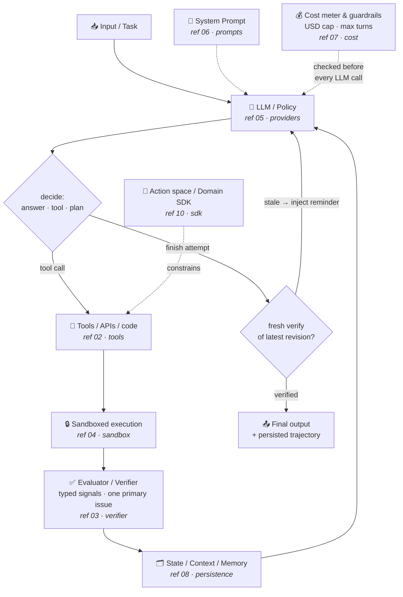
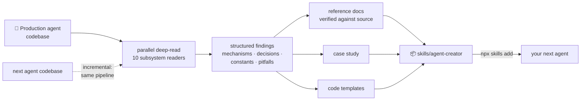

# agent-creator-skill

**Reusable design knowledge for building LLM agents — distilled from production agent codebases.**

Most agent knowledge is trapped inside working codebases: the loop invariants,
the guardrail constants, the failure modes someone already paid to discover.
This repository extracts that knowledge into an installable **agent skill**:
ten module references, runnable code templates, and per-agent case studies.
Point your coding agent (Claude Code, Codex, Cursor, …) at it and say
*"build me an agent that does X"* — it will design against patterns that are
known to survive production, instead of reinventing a fragile ReAct loop.

## What's inside

```
skills/agent-creator/
├── SKILL.md                     # entry point: anatomy, build order, invariants
├── references/                  # one deep-dive per agent module
│   ├── 00-agent-anatomy.md      #   the module map & how modules interlock
│   ├── 01-agent-loop.md         #   turn lifecycle, success gate, escalation
│   ├── 02-tools.md              #   declarative tools, errors-as-data, binding
│   ├── 03-evaluator-verifier.md #   typed signals, primary-issue selection
│   ├── 04-sandboxed-execution.md#   subprocess isolation, timeouts, rlimits
│   ├── 05-providers.md          #   multi-LLM abstraction, codecs, compaction
│   ├── 06-prompts.md            #   prompt-as-code, per-provider build matrix
│   ├── 07-cost-guardrails.md    #   pricing tables, dual ledgers, hard caps
│   ├── 08-state-persistence.md  #   staging→promote, traces, provenance
│   ├── 09-orchestration.md      #   entry points, fork/edit/rerun, exit codes
│   └── 10-action-space-sdk.md   #   shaping what the model may produce
├── templates/                   # stdlib-only Python skeletons to copy
│   ├── agent_loop.py  tools.py  verifier.py
│   ├── provider_adapter.py  cost_meter.py  sandbox_runner.py
│   └── README.md
└── case-studies/
    ├── README.md                # how to distill the next agent (incremental)
    └── articraft.md             # case study 01: agentic 3D-asset generator
```

Every reference follows the same contract: **why the module exists → how a
real agent implements it (with `file:line` provenance) → design decisions
with tradeoffs → production constants → a generic reusable pattern → pitfalls
→ checklist.**

## The agent anatomy



The one diagram to internalize: **the model never declares success by
itself.** A finish attempt only exits the loop when the *latest* artifact
revision has a fresh, mechanically verified pass — everything else loops back
with structured feedback.

## How knowledge gets in here



Each distilled agent adds a case study and enriches the references where its
design differs. Currently distilled: **[Articraft](skills/agent-creator/case-studies/articraft.md)**
(text → articulated 3D assets; ~20k lines of agent code read and verified).

## Install

```bash
npx skills add https://github.com/alfredzhang98/agent-creator-skill --skill agent-creator
```

Then ask your agent things like:

- *"Using the agent-creator skill, design an agent that writes and verifies
  SQL migrations."*
- *"Add a hard cost cap to my agent — follow reference 07."*
- *"Review my agent loop against the pitfalls in references 01 and 03."*

## The five invariants

Distilled to one screen — the non-negotiables every reference elaborates:

1. **Success is verified, never self-reported** — revision-gated fresh verify.
2. **Tool errors are data, not exceptions** — the model self-corrects in-band.
3. **One primary issue at a time** — priority ladder over N failures.
4. **Budgets are enforced in the loop** — USD cap pre-call and post-usage.
5. **Never trust generated code with your process** — subprocess + kill.

## License

Apache-2.0. Case-study knowledge is distilled from
[Articraft](https://github.com/articraftresearch/Articraft) (Apache-2.0);
see each case study for its source attribution.
